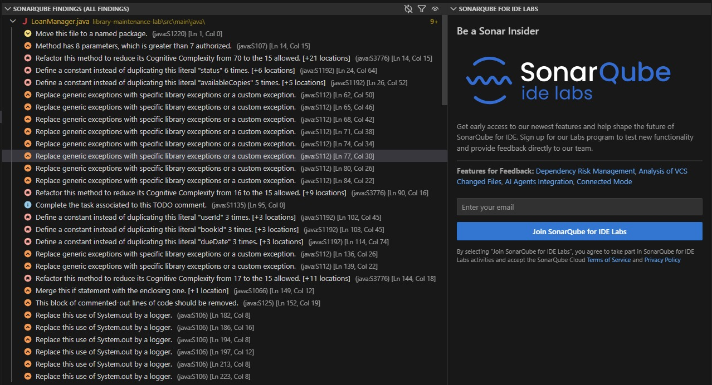

# Correções Atividade 4 - Segundo Bimestre

### Erros SonarQube

O SonarQube encontrou era de 213 code smells em  todos os arquivos, por isso, decidimos focar somente nos erros da classe LoanManager.

SonarQube:

## Refactor realizado

Foi realizado um refactor no método `borrowBook` da classe `LoanManager`, com o objetivo de reduzir sua complexidade cognitiva.

### Problema

O método apresentava:
- Muitos `if` aninhados (deep nesting)
- Alta complexidade
- Baixa legibilidade
- Dificuldade de manutenção

### Solução aplicada

Foi utilizada a técnica de **extração de métodos**, separando responsabilidades em funções menores:

- `validateUser`
- `validateBook`
- `validateLoanRules`
- `resolveBorrowDate`
- `resolveDueDate`

### Resultado

- Código mais legível e organizado  
- Redução da complexidade cognitiva  
- Melhor manutenção futura  
- Comportamento original preservado  
